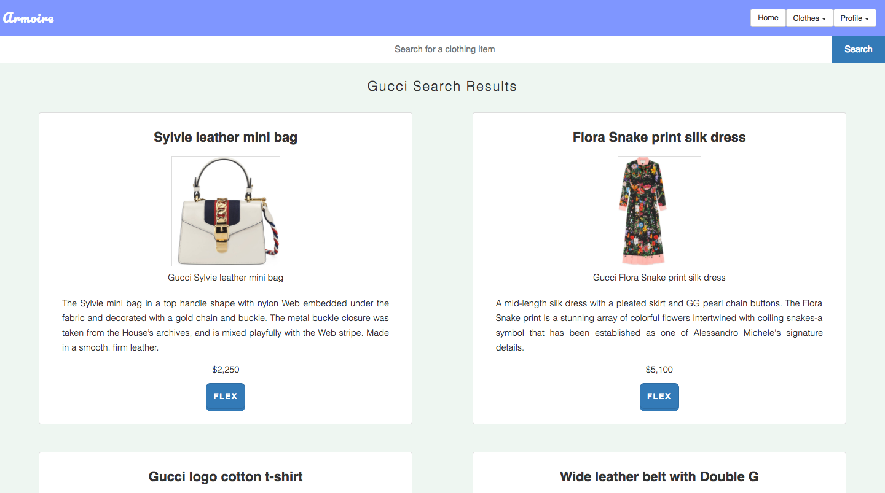

# Armoire Online Closet 💃🏾
Web App that could be utilize as an online wardrobe / closet to help create a visual representation of a person's clothing collection

## What is DuckHunt?

DuckHunt is a simple point and click game that is playable in the browser. The objective of the game is to 
kill all the ducks on the screen and reach the target score for the difficulty level. 

## Technical Discussion

- HTML5
- CSS3
- JavaScript with jQuery library

### Notes on Game Structure

The most challenging part of this project was getting the click events to work correctly and also getting the ducks to fly across the screen in a almost random manner. I focused a lot on using functions to control specific aspects of the game. I think I did a good job of pacing myself to complete this project. 

I used open license assets such as sprites and audio clips in order for me create a more visually pleasing game.

## The Making of DuckHunt

Just the average blood, sweat, and tears. 😌

For me it was a lot easier to not worry about pseudo code and just start programming. I remember just starting off with a div that would fly across my screen, and I would have to click on it to see if it was possible for me to hit it. From there I went to see if I could a log a score once it was clicked. This was the initial set up for my game and from here I was able to build upon additional features until I had a fully functional game. I used functions as a way for me to break up the game into sections that also tracked my progress on completion. 

## Opportunities for Future Growth
I'm aware of a bug that allows the player to keep playing even if they won or lost. On top of that because I was constantly calling a function to make the ducks move, sometimes it will glitch out when you click on a duck as the function is being called. So then the duck appears on the screen longer allowing the user to shoot it multiple times. In the future it would be better to make sure that the game actually ends when a player wins or loses. In my case even though the "game is over" the player is still capable of clicking on elements. It would be better if the ducks bounced off of the walls instead of just flying back and forth, and up and down. This would allow for more better fluid random movement. 
