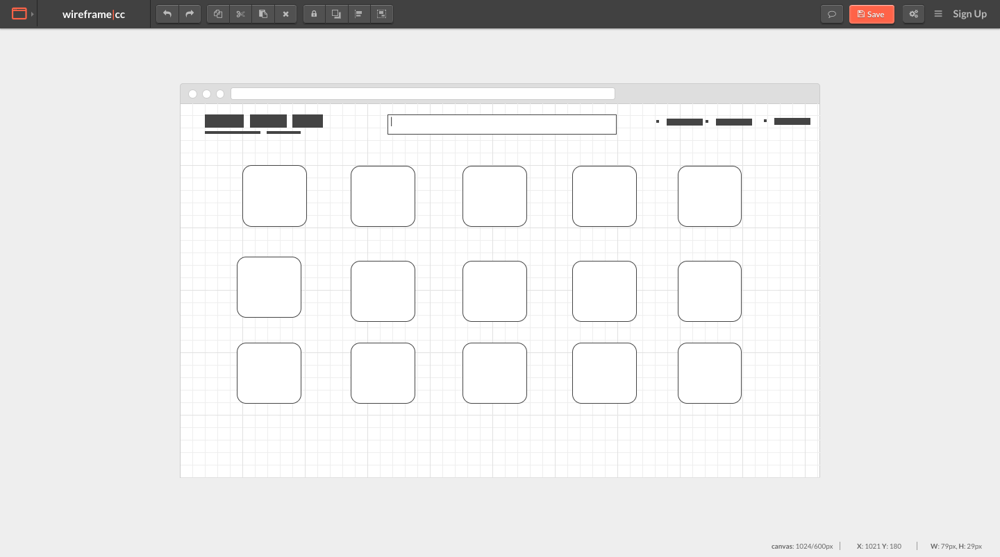
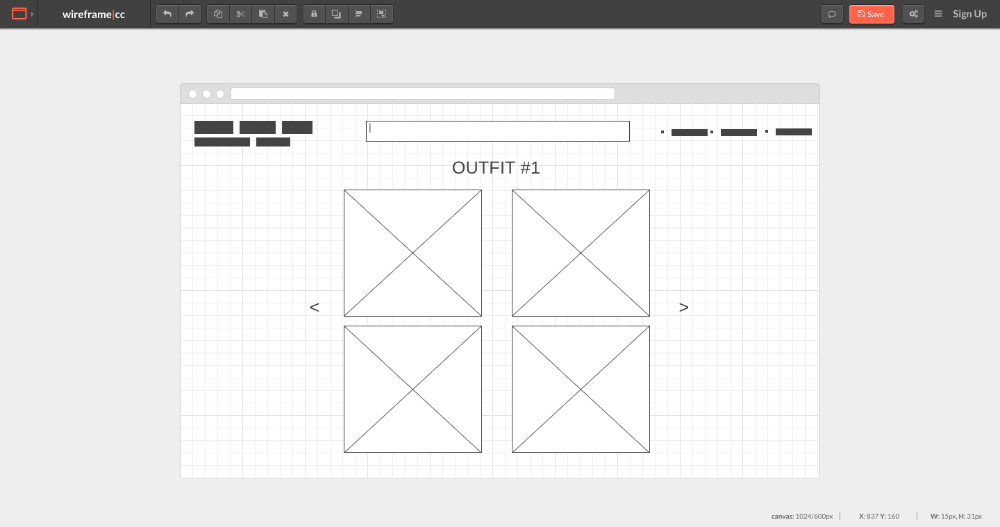

# Armoire Online Closet 💃🏾
Web App that could be utilize as an online wardrobe / closet to help create a visual representation of a person's clothing collection

## What is Armoire?

DuckHunt is a simple point and click game that is playable in the browser. The objective of the game is to 
kill all the ducks on the screen and reach the target score for the difficulty level. 

## Technical Discussion

Front-end:
- HTML, CSS

Back-end:
- Node.js, Express, PostgreSQL

``
const Outfits = {
    findAll: (userid)=>{
        return db.query(`
        select o.*,c.* , o.name as outfitName, o.id as outfitId from clothes c inner join outfits o on c.id = o.top_id WHERE o.userid = $1 union all
        select o.*,c.* , o.name as outfitName, o.id as outfitId from clothes c inner join outfits o on c.id = o.bottom_id WHERE o.userid = $1 union all
        select o.*,c.* , o.name as outfitName, o.id as outfitId  from clothes c inner join outfits o on c.id = o.shoe_id WHERE o.userid = $1
        `,[userid])
    },
    findById: (id)=>{
      return db.query(`
        select o.*,c.* , o.name as outfitName, o.id as outfitId from clothes c inner join outfits o on c.id = o.top_id WHERE o.id = $1 union all
        select o.*,c.* , o.name as outfitName, o.id as outfitId from clothes c inner join outfits o on c.id = o.bottom_id WHERE o.id = $1 union all
        select o.*,c.* , o.name as outfitName, o.id as outfitId  from clothes c inner join outfits o on c.id = o.shoe_id WHERE o.id = $1
      `, [id])
    }
}

``

## The Making of Armoire

## App Structure

## Opportunities for Future Growth

The project's name and description
Your wireframes and user stories
The technologies, APIs, and modules you used and a description of each
A code snippet of a part of the app you're particularly proud of
Any things you plan to fix or features you plan to add
Instructions for downloading the code and running it on localhost
